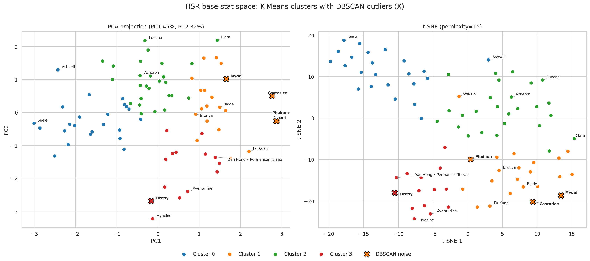
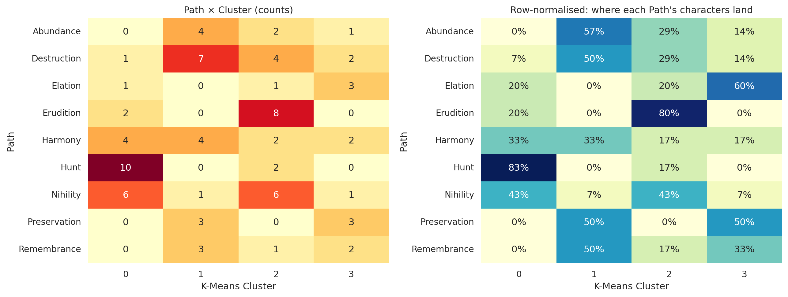
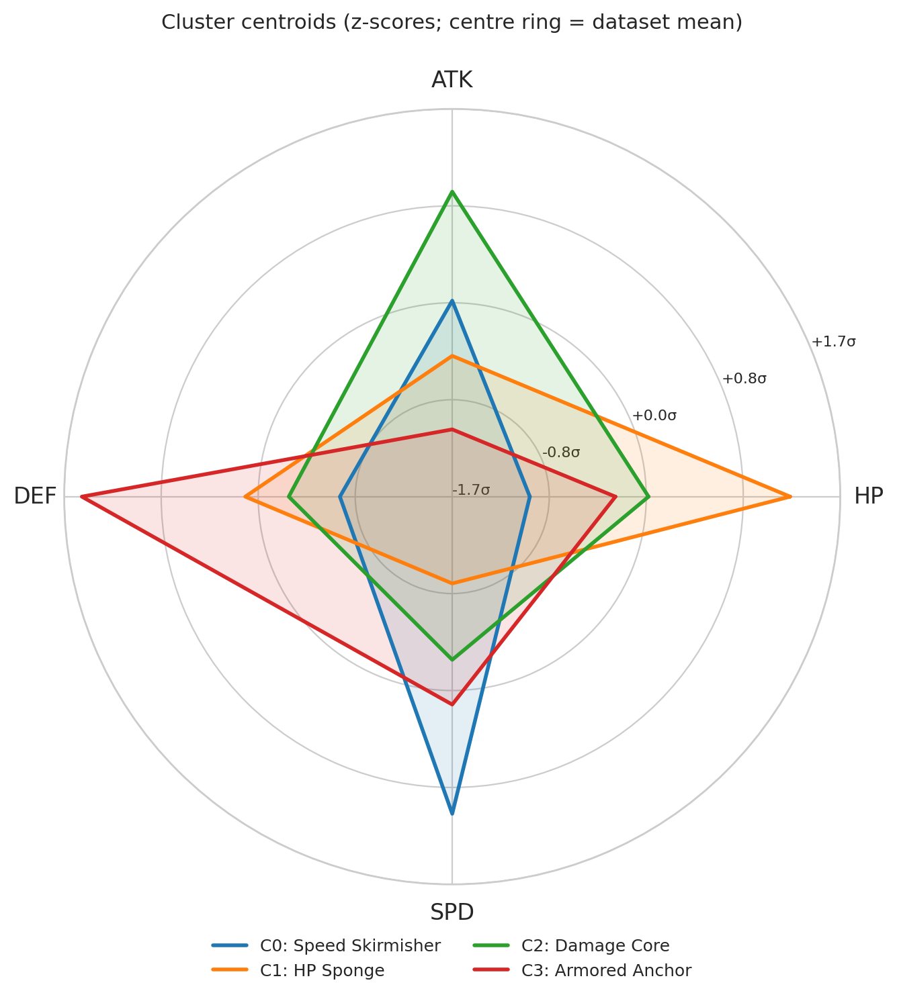

# Archetype Mining: Classifying Role Transgression in Honkai: Star Rail

An unsupervised machine learning study of whether character base-stat allocations line up with their assigned in-game Paths in *Honkai: Star Rail*, and which characters sit far from their Path's stat profile ("role transgressors").

---

## Executive Summary

* **Stats align only weakly with Path.** Normalized mutual information between K-Means clusters and Path is $0.25$ and the adjusted Rand index is $0.11$ (both weak).
* **The stat space is continuous.** Silhouette is $0.28$: characters form overlapping regions, not isolated role-specific clusters.
* **Hypothesis (untested here):** Path identity may be defined mostly by skill kits, traces and Light Cones rather than base stats. This study uses base stats only, so it cannot confirm that.

---

## Visual Deliverables

### 1. Macro Archetypes (PCA & t-SNE)
K-Means ($k=4$) clusters in 2D. Black `X` marks DBSCAN noise points. Gepard and Phainon are close in scaled space (distance $0.79$), so their PCA markers overlap; the t-SNE panel separates them.



### 2. Path vs. Cluster Heatmap
Hunt and Erudition align strongly with one cluster each; Harmony is diffuse.



### 3. Cluster Centroid Profiles (Radar)
Centroid z-scores ($\mu = 0$, $\sigma = 1$ across all characters).



---

## Discovered Stat Archetypes (K-Means, $k=4$)

| Cluster | Archetype | Centroid (Lv.80 HP / ATK / DEF / SPD) | Path distribution |
| :---: | :--- | :--- | :--- |
| **0** | **Speed Skirmisher** | 958 / 604 / 416 / **107** | 10 of 12 Hunt characters (83%). Also holds 15 of 23 four-star characters, so part of this cluster reflects rarity (lower base stats), not only speed. |
| **1** | **HP Sponge** | **1362** / 563 / 504 / 97 | HP-heavy characters such as Blade, Gepard, Fu Xuan and Mydei. Splits Preservation (3 here, 3 in Cluster 3). |
| **2** | **Damage Core** | 1142 / **686** / 463 / 100 | 8 of 10 Erudition characters (80%), plus high-ATK units from several Paths. |
| **3** | **Armored Anchor** | 1091 / 508 / **656** / 102 | Highest-DEF characters, e.g. Aventurine, Hyacine, Dan Heng • Permansor Terrae, Firefly. |

---

## Key Findings

### 1. Role Transgressions
A character is a *transgressor* when its K-Means cluster is outside the modal cluster(s) of its own Path. Ties between clusters are allowed, and a Path whose best cluster holds under 40% of its members is treated as *diffuse* (Harmony here) and yields no transgressors. This gives 21 of 86 characters. `fit_margin` (in `role_transgressors.csv`) ranks how far a character sits from its own Path's centroid relative to the nearest other Path; margins near zero are borderline cases.

* **Firefly (Destruction):** largest margin ($1.95$). Her DEF ($776$) is joint highest in the roster with Dan Heng • Permansor Terrae, paired with low HP ($815$), which places her in Armored Anchor.
* **Luocha (Abundance):** high ATK ($757$) and low DEF ($364$) put him in Damage Core. His healing is ATK-based ("70% of Luocha's ATK plus 1025" in the skill data).
* **Lynx (Abundance):** HP $1058$ / ATK $494$ / DEF $551$, placing her in Armored Anchor. Her healing scales with Max HP, so her ATK is not the relevant stat; this is a different profile from Luocha's, not a mirror image.
* **Harmony is diffuse:** its members split $4/4/2/2$ across the four clusters, so Harmony units do not share one base-stat profile.

### 2. DBSCAN Anomaly Audit ($eps = 1.45$, $min\_samples = 4$)
Noise points (`label = -1`). *Isolation* is the distance to the 4th-nearest neighbour divided by the dataset median.

* **Mydei:** isolation $2.9\times$. HP $+2.3\sigma$ with very low DEF ($194$, $-2.8\sigma$) and low ATK ($-2.1\sigma$).
* **Castorice:** isolation $1.7\times$. Highest HP in the roster ($1630$, $+2.8\sigma$).
* **Firefly:** isolation $1.9\times$. DEF $+2.7\sigma$ with HP $-1.8\sigma$ (inverted HP/DEF coupling).
* **Phainon:** isolation $1.7\times$. DEF $+2.0\sigma$, HP $+1.7\sigma$, SPD $-1.5\sigma$.
* *Blade* was **not** flagged: his HP sits inside the HP Sponge cluster, at a Euclidean distance of $0.29$ (scaled units) from its centroid.

---

## Methodology Notes

* **Stats are Level 80.** HP/ATK/DEF = ascension-6 base + per-level add $\times 79$; SPD is `base_spd` (no level scaling). Features are standardized with `StandardScaler`.
* **Max Energy is excluded by default.** In this dataset it is not a reliable ultimate cost (e.g. Acheron $=9$, Evanescia $=480$, Castorice missing). `--include-energy` runs it as a sensitivity check (median-imputed, log1p).
* **Choice of $k$.** $k$ is the best silhouette inside the preferred window $k \in [4, 6]$. $k=3$ scores marginally higher ($0.289$ vs $0.284$) and the elbow is mild, so the two are close to a tie. $k=4$ is used because it separates HP-based from DEF-based tanks. $k \ge 6$ produces a single-member cluster. The $k=3$ and $k=4$ partitions agree only moderately (ARI $0.49$).
* **DBSCAN is sensitive.** With $n=86$, the noise set changes with `eps` (see `dbscan_sweep.csv`). Treat the four outliers as the most isolated points at this setting.
* **Scale caveat.** SPD has a small spread ($\sigma \approx 5$), so standardization gives a 2-point SPD gap the same weight as a ~180-point HP gap.

---

## Repository Structure

```text
├── archetype_mining.py          # Ingestion, clustering, evaluation, plotting
├── requirements.txt             # Direct dependencies (lower bounds)
├── requirements-lock.txt        # Exact versions the results were produced with
├── data/
│   ├── characters.csv           # Path, element, rarity, base SPD, max energy
│   └── character_stats.csv      # Ascension stat curves (HP, ATK, DEF)
└── outputs/
    ├── figures/                 # PNG plots
    └── tables/                  # character_assignments, role_transgressors,
                                 # dbscan_anomaly_audit, centroids_*, k_scan,
                                 # dbscan_sweep, metrics, features_lv80_raw
```

---

## Getting Started

Tested with Python 3.12.

### 1. Set up a virtual environment

```bash
git clone <YOUR-REPO-URL>
cd hsr-archetype-mining
```

- **Windows (PowerShell):**
  ```powershell
  python -m venv .venv
  .\.venv\Scripts\Activate.ps1
  ```
- **macOS / Linux:**
  ```bash
  python3 -m venv .venv
  source .venv/bin/activate
  ```

```bash
pip install -r requirements.txt          # or requirements-lock.txt for exact versions
```

### 2. Run

```bash
python archetype_mining.py --data-dir data/ --out-dir outputs
```

### CLI arguments

- `--k <int>`: override the automatic K-Means cluster count (e.g. `--k 5`)
- `--eps <float>`: override the DBSCAN epsilon (e.g. `--eps 1.2`)
- `--min-samples <int>`: DBSCAN density threshold (default `4`)
- `--include-energy`: sensitivity run with imputed `Max Energy`
- `--seed <int>`: random seed (default `42`)